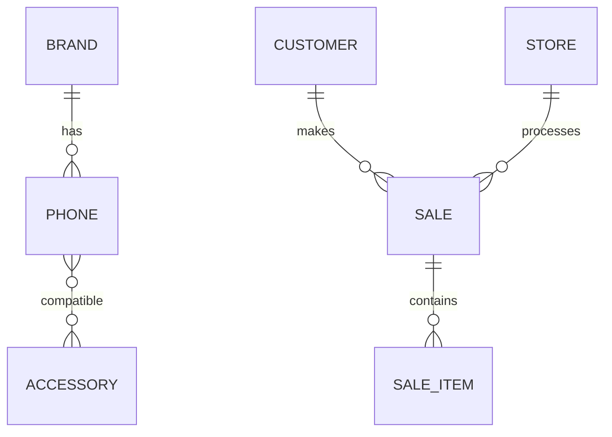

# 📁 Estrutura do Projeto Revenda API

## 🎯 Organização por Entidade

O projeto foi reorganizado seguindo o padrão **Domain-Driven Design (DDD)**, onde cada entidade possui sua própria pasta com todos os arquivos relacionados.

## 📂 Estrutura de Pastas

### **Pasta `src/db/`**
Contém todas as configurações relacionadas ao banco de dados:

- **`migrations/`**: Scripts de criação e alteração da estrutura do banco
- **`seeds/`**: Scripts de inserção de dados iniciais

### **Pastas de Entidades**
Cada entidade possui sua própria pasta com a seguinte estrutura:

```
entity-name/
├── dto/                    # Data Transfer Objects
│   ├── create-entity.dto.ts
│   └── update-entity.dto.ts
├── entity.entity.ts        # Definição da entidade TypeORM
├── entity.controller.ts    # Controller com endpoints REST
├── entity.service.ts       # Lógica de negócio
└── entity.module.ts        # Módulo NestJS
```

### **Entidades Implementadas:**

#### 1. **`src/brand/`** - Marcas
- Gerenciamento de marcas de celulares
- Relacionamento 1:N com phones

#### 2. **`src/phone/`** - Celulares
- Catálogo de celulares
- Relacionamento N:1 com brands
- Relacionamento N:N com accessories

#### 3. **`src/accessory/`** - Acessórios
- Catálogo de acessórios
- Controle de estoque
- Relacionamento N:N com phones (compatibilidade)

#### 4. **`src/store/`** - Lojas
- Gerenciamento de lojas
- Relacionamento 1:N com sales

#### 5. **`src/customer/`** - Clientes
- Cadastro de clientes
- Tipos: regular, premium, vip
- Relacionamento 1:N com sales

#### 6. **`src/sale/`** - Vendas
- Sistema completo de vendas
- Contém também `sale-item.entity.ts`
- Relacionamento N:1 com customers e stores
- Relacionamento 1:N com sale-items

## 🔄 Relacionamentos



## 📋 Vantagens da Nova Estrutura

### ✅ **Organização Clara**
- Cada entidade é auto-contida
- Fácil localização de arquivos
- Reduz acoplamento entre módulos

### ✅ **Manutenibilidade**
- Mudanças em uma entidade não afetam outras
- Facilita refatoração
- Código mais limpo e organizado

### ✅ **Escalabilidade**
- Fácil adição de novas entidades
- Estrutura consistente
- Facilita trabalho em equipe

### ✅ **Testabilidade**
- Testes podem ser organizados por entidade
- Isolamento de responsabilidades
- Mocks mais simples

## 🚀 Como Adicionar Nova Entidade

1. **Criar pasta da entidade**: `src/nova-entidade/`

2. **Criar arquivos básicos**:
   ```bash
   nova-entidade/
   ├── dto/
   │   ├── create-nova-entidade.dto.ts
   │   └── update-nova-entidade.dto.ts
   ├── nova-entidade.entity.ts
   ├── nova-entidade.controller.ts
   ├── nova-entidade.service.ts
   └── nova-entidade.module.ts
   ```

3. **Adicionar no app.module.ts**:
   ```typescript
   import { NovaEntidadeModule } from './nova-entidade/nova-entidade.module';
   
   @Module({
     imports: [
       // ... outros módulos
       NovaEntidadeModule,
     ],
   })
   ```

4. **Criar migration**: `npm run migration:create -- src/db/migrations/CreateNovaEntidadeTable`

## 📝 Convenções de Nomenclatura

- **Pastas**: kebab-case (ex: `sale-item`)
- **Arquivos**: kebab-case (ex: `sale-item.entity.ts`)
- **Classes**: PascalCase (ex: `SaleItem`)
- **Métodos**: camelCase (ex: `findByCustomer`)
- **Variáveis**: camelCase (ex: `customerId`)

## 🔧 Configurações Atualizadas

- **`app.module.ts`**: Imports atualizados para novos caminhos
- **`ormconfig.ts`**: Caminhos das entidades e migrations atualizados
- **`database.config.ts`**: Configuração para incluir seeds
- **`README.md`**: Documentação atualizada com nova estrutura
